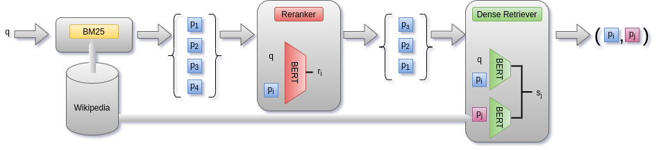

# Combining Lexical and Dense Retrieval for Computationally Efficient Multi-hop Question Answering
<p align="center"></p>

## Citation
If you find this work helpful or use it in your own work, please cite our paper. 
```
@inproceedings{sidiropoulos-etal-2021-combining,
    title = "Combining Lexical and Dense Retrieval for Computationally Efficient Multi-hop Question Answering",
    author = "Sidiropoulos, Georgios  and
      Voskarides, Nikos  and
      Vakulenko, Svitlana  and
      Kanoulas, Evangelos",
    booktitle = "Proceedings of the Second Workshop on Simple and Efficient Natural Language Processing",
    month = nov,
    year = "2021",
    address = "Virtual",
    publisher = "Association for Computational Linguistics",
    url = "https://aclanthology.org/2021.sustainlp-1.7",
    doi = "10.18653/v1/2021.sustainlp-1.7",
    pages = "58--63",
}
```
